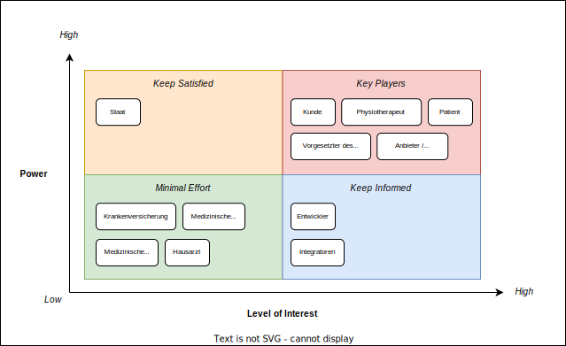

[[section-stakeholders]]
== Stakeholders

Die nachfolgende Tabelle gibt einen Gesamtüberblick über die bestehenden Stakeholder sowie die jeweiligen Systemaspekte, welche von ihnen als besonders wichtig erachtet werden.

[options="header",cols="4,6"]
|===
|Stakeholder|Systemaspekte
|Physiotherapeut
a|
* Intuitive Benutzeroberfläche
* Schnittstelle Planungssoftware - Integration Layer (Datenimport)
* Therapie- / Sessionverwaltung
* Übungsverwaltung
* Patientenverwaltung
* Monitoring
* Reporting

|Patient
a|
* Intuitive Benutzerschnittstelle
* Hohe Kompatibilität mit bestehender Hard- und Software (Smartphone, Fitnesstracker)
* Zweckmässige und zeitlich eingeschränkte Aufzeichnung der persönlichen Gesundheitsdaten
* Sichere und rechtlich anerkannte Ablage der persönlichen Gesundheitsdaten
* Explizite Einwilligung zur Datenweitergabe an Drittpersonen (z.b. medizinische Forschung)
* Zuverlässige Datenübermittlung (auch bei Netzwerkunterbrüchen)

|Vorgesetzter des Physiotherapeuten
(z.B. Abteilungsleiter innerhalb eines Spitals)
a|
* Therapeutenverwaltung
* Monitoring
* Reporting

|Kunde (finanziert die Verwendung des Integration Layers, z.B. Spitalleitung)
a|
* Gesamtsystem soll möglichst kosteneffizient sein
* Minimaler Integrationsaufwand mit verwendeter Planungssoftware
* Intuitive Benutzerschnittstelle soll zu guter Resonanz bei Hauptbenutzergruppen (Physiotherapeut, Patient) führen
* Hoher Automatisierungsgrad soll Auslastungslücken bei Physiotherapeuten minimieren (= möglichst viele Patienten mit möglichst wenigen Therapeuten behandeln)

|Staat
a|
* Gesamtsystem:
Einhaltung existierender Datenschutzverordnungen und -gesetze. Betrifft die Aufzeichnung, Ablage und Weitergabe der persönlichen Gesundheitsdaten
* Datenschnittstelle für die Bereitstellung der Gesundheitsdaten an das https://www.patientendossier.ch/[Elektronische Patientendossier (EPD)]

|Krankenversicherung
a|
* Datenschnittstelle für die Bereitstellung der Therapiedaten zu Marketingzwecken
** Aktivitäten ermöglichen Vergünstigungen / Prämienreduktionen (VVG)
** (Fitness-)Challenges

|Medizinische Forschung
a|
* Datenschnittstelle für die Bereitstellung anonymisierter Gesundheitsdaten
** für (Langzeit-)Studien und Analysen
** für das Training von AI-Modellen

|Medizinische Einrichtung (z.B. Spital), Hausarzt
a|
* Datenschnittstelle für die Bereitstellung der Gesundheitsdaten als Hilfsmittel für
** Ambulante / Stationäre Untersuchungen und Eingriffe
** Konsultationen
** Diagnosen
** Verschreibung von Medikamenten / Therapien

|Anbieter des Integration Layers / Product Owner
a|
* Kurzer Time-to-Market
* Kostengünstige Entwicklung und Erweiterung

|Entwickler des Integration Layers
a|
* Einfache Erweiterbarkeit bei neuen Features
* Möglichst hoher Automatisierungsgrad (Entwicklung, Testing, CI/CD)
* Möglichst effizientes Onboarding neuer Entwickler (aufgrund guter Verständlichkeit und Einfachheit der Architektur und Codebase)

|Technische Integratoren des Integration Layers
a|
* Minimaler Integrationsaufwand
* Schnittstellen des Integration Layers, mit welchen kommuniziert werden soll
* Technische Dokumentation als Integrationshilfe
* Stages / Umgebungen, welche angebunden werden können (z.B. Sandbox, INT, PROD)
|===

=== Stakeholder Powergrid

Für die erweiterte Analyse und Verwaltung der bestehenden Stakeholder werden diese im Nachfolgenden im Rahmen eines Powergrids eingestuft.

=== Priorisierung der Stakeholder

Basierend auf dem Verhältnis zwischen Einfluss (Power) und Interessensgrad (Level of Interest) des Stakeholder Powergrids werden die Bedürfnisse der nachfolgenden Stakeholder prioritär berücksichtigt:

* Anbieter des Integration Layers / Product Owner
* Kunde
* Physiotherapeut
* Patient

__Zufriedenstellen__

* Staat

__Informiert halten__

* Entwickler des Integration Layers
* Vorgesetzter des Physiotherapeuten
* Technische Integratoren des Integration Layers
